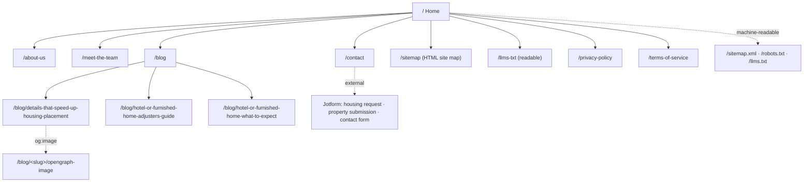

# Nova Havens — novahavens.com

The public website for **Nova Havens Temporary Housing**, an insurance
relocation housing company headquartered in Nashville, Tennessee. The site is
a statically generated Next.js application: every page is rendered to HTML at
build time, served from a CDN, and hydrated only where a component needs
interactivity.

- Production: https://novahavens.com
- Framework: Next.js 16 (App Router) · React 19 · TypeScript · Tailwind CSS v4
- Hosting: Vercel (recommended) — see [docs/DEPLOYMENT.md](docs/DEPLOYMENT.md)

## Documentation

| Document                                 | What it covers                                                                                                                         |
| ---------------------------------------- | -------------------------------------------------------------------------------------------------------------------------------------- |
| [docs/DEPLOYMENT.md](docs/DEPLOYMENT.md) | Deploying to Vercel (and Replit/Docker), environment variables, domains, the daily data sync                                           |
| [docs/SEO.md](docs/SEO.md)               | Google Search Console setup, the sitemap, submitting URLs for indexing, and launching the new site **without losing existing traffic** |
| [docs/CMS.md](docs/CMS.md)               | How content is modelled today and how to plug in a CMS later                                                                           |
| [docs/BRAND.md](docs/BRAND.md)           | Brand asset inventory, specs, and the placeholders to replace                                                                          |
| [docs/COMPANY.md](docs/COMPANY.md)       | Every company fact published on the site, and where it is defined in code                                                              |

## Quick start

Prerequisites: Node.js 22+ and pnpm 10 (`corepack enable` installs the pinned
version automatically).

```bash
pnpm install          # install dependencies
pnpm dev              # http://localhost:3000 with hot reload
pnpm build            # production build (static HTML + assets)
pnpm start            # serve the production build locally
pnpm lint             # ESLint (Next.js rules + the design-token guard)
pnpm typecheck        # TypeScript
pnpm test:smoke       # Playwright smoke tests against the production build
```

Copy `apps/web/.env.example` to `apps/web/.env.local` for optional settings
(analytics, Search Console verification). Nothing is required to run locally.

## Repository structure

```
.
├── apps/web/                      The Next.js site (the only deployable)
│   ├── src/app/                   Routes (App Router). One folder per URL.
│   │   ├── layout.tsx             Root layout: fonts, metadata defaults, header/footer, analytics
│   │   ├── page.tsx               /                 Home
│   │   ├── about-us/page.tsx      /about-us
│   │   ├── meet-the-team/page.tsx /meet-the-team
│   │   ├── contact/page.tsx       /contact
│   │   ├── blog/page.tsx          /blog
│   │   ├── blog/[slug]/page.tsx   /blog/<slug>      pre-rendered for every post
│   │   ├── blog/[slug]/opengraph-image.tsx          generated social card per post
│   │   ├── privacy-policy/, terms-of-service/, llms-txt/
│   │   ├── sitemap/page.tsx       /sitemap          human-readable site map
│   │   ├── llms.txt/route.ts      /llms.txt         plain-text AI index
│   │   ├── maps/coverage-*.svg/   /maps/coverage-{compact,detailed}.svg  US coverage maps built from Census geometry
│   │   ├── sitemap.ts             /sitemap.xml
│   │   ├── robots.ts              /robots.txt
│   │   └── not-found.tsx          branded 404
│   ├── src/components/
│   │   ├── layout/                Navbar, Footer, Logo, analytics scripts
│   │   ├── home/                  Home-page sections (carousels, map, tabs, marquee)
│   │   ├── blog/                  Post renderer, filterable list
│   │   ├── team/                  Team grid + profile dialog
│   │   ├── contact/               Embedded Jotform
│   │   ├── shared/                JSON-LD, tracked links, CTAs, FAQ, icons
│   │   └── ui/                    Button, Sheet, Tabs, Card (shadcn-style primitives)
│   ├── src/config/site.ts         ★ Single source of truth for company facts, URLs, brand
│   ├── src/config/routes.ts       Page registry → sitemap.xml, /sitemap, tests
│   ├── src/content/               ★ Site content: blog posts, FAQs, how-it-works, team, llms.txt
│   │   └── source.ts              Content access layer — swap for a CMS here (docs/CMS.md)
│   ├── src/lib/                   seo.ts (metadata + JSON-LD), property-stats, team loader, us-map (SVG maps), analytics
│   ├── src/styles/                globals.css (Tailwind) + tokens.css (design tokens)
│   ├── data/                      Synced data: property-stats.json, team.json (written by scripts)
│   ├── scripts/                   sync-property-stats.ts (Monday.com), sync-team.mjs (Google Form)
│   ├── public/                    Images, logos, favicon, og-image, brand/ placeholders
│   ├── tests/smoke.spec.ts        Playwright smoke tests
│   ├── design/tokens.json         Design tokens (DTCG) — the source for tokens.css
│   └── next.config.ts             Headers, redirects, images, React Compiler
├── docs/                          Operations documentation (see table above)
├── .github/workflows/
│   ├── ci.yml                     Lint, typecheck, build, smoke tests on every PR
│   └── sync-data.yml              Daily data refresh → commit → redeploy
└── .replit, replit.md             Optional Replit preview/deploy configuration
```

★ = the two places most edits happen.

## Site map

Every public URL, as a visitor sees it. The same list drives
`/sitemap.xml` (for search engines), the human-readable `/sitemap` page, and
the smoke tests — all read `apps/web/src/config/routes.ts`, so adding a page
there updates all three.



| URL                                        | Purpose                                                                                                        | Rendered from                                              |
| ------------------------------------------ | -------------------------------------------------------------------------------------------------------------- | ---------------------------------------------------------- |
| `/`                                        | Home: hero, trust figures, coverage, amenities, showcase, partners, how it works, reviews, FAQ, emergency line | `app/page.tsx`                                             |
| `/about-us`                                | Company definition and facts, principles, FAQ                                                                  | `app/about-us/page.tsx`                                    |
| `/meet-the-team`                           | Team roster with profile dialogs, values                                                                       | `app/meet-the-team/page.tsx` + `data/team.json`            |
| `/contact`                                 | Phone lines, email, HQ, embedded contact form, intake CTAs                                                     | `app/contact/page.tsx`                                     |
| `/blog`                                    | Filterable article list                                                                                        | `app/blog/page.tsx` + `content/blog.ts`                    |
| `/blog/<slug>`                             | Article with FAQ schema and generated social card                                                              | `app/blog/[slug]/page.tsx`                                 |
| `/sitemap`                                 | Human-readable site map (this list)                                                                            | `app/sitemap/page.tsx` + `config/routes.ts`                |
| `/llms-txt`                                | Readable version of `/llms.txt`                                                                                | `app/llms-txt/page.tsx` + `content/llms.ts`                |
| `/privacy-policy`, `/terms-of-service`     | Legal drafts (banner until reviewed)                                                                           | `app/*/page.tsx`                                           |
| `/sitemap.xml`, `/robots.txt`, `/llms.txt` | Crawler and AI-assistant resources                                                                             | `app/sitemap.ts`, `app/robots.ts`, `app/llms.txt/route.ts` |

Old URLs from the previous build (`/<page>/index.html`, trailing slashes,
`www.`) 301/308-redirect to the canonical form. Anything else returns the
branded 404.

## How the site works

### Rendering model

Everything is **static** (`next build` emits HTML for every route). There are
no server-side requests at page-view time, no database, and no API the browser
depends on. That gives the fastest possible first paint, trivially cacheable
pages, and nothing to go down at 2 a.m. when a family needs the phone number.

Components are **React Server Components** by default and ship zero
JavaScript. Only these pieces are client components ("islands"):

| Island                                                    | Why it needs JS                                       |
| --------------------------------------------------------- | ----------------------------------------------------- |
| `layout/navbar.tsx`                                       | Mobile menu sheet, active-link highlight              |
| `home/showcase-carousel.tsx`, `home/reviews-carousel.tsx` | Autoplay, swipe, embla                                |
| `home/how-it-works-tabs.tsx`                              | Radix tabs                                            |
| `shared/faq-accordion.tsx`                                | Native `<details>`; JS only fires the analytics event |
| `blog/blog-list.tsx`                                      | Category filter                                       |
| `team/team-grid.tsx` + `team-member-modal.tsx`            | Scroll reveal, focus-trapped dialog                   |
| `contact/contact-form-embed.tsx`                          | Iframe load/timeout handling                          |
| `shared/tracked-link.tsx`                                 | Click analytics on external links                     |

The React Compiler (`reactCompiler: true`) auto-memoises those islands.

### Data flow

```
src/config/site.ts ───────────────► every page, JSON-LD, llms.txt, sitemap
src/content/*.ts ──► source.ts ───► blog pages, FAQ, team fallback, llms.txt
data/property-stats.json ─────────► lib/property-stats.ts ──► home + contact figures
                                 └► lib/us-map.ts ──► /maps/coverage-*.svg (state shading + metro pins)
data/team.json (optional) ────────► lib/team.ts (merged over content/team.ts) ──► team page
```

`data/*.json` is refreshed by `scripts/` on a daily schedule
(`.github/workflows/sync-data.yml`). A change is committed to `main`, which
triggers a new deployment. The site therefore never fetches live data in the
browser, yet the figures stay current.

### SEO layer

- `src/lib/seo.ts` builds per-page `Metadata` (title, description, canonical,
  Open Graph, Twitter) and the JSON-LD graph. One `LocalBusiness` entity
  (`https://novahavens.com/#organization`) and one `WebSite` node are
  referenced from every page.
- `app/sitemap.ts`, the `/sitemap` page, `app/robots.ts` and `app/llms.txt/route.ts`
  are generated from the same registry and content, so they can never
  disagree with the pages.
- `app/blog/[slug]/opengraph-image.tsx` renders a branded 1200×630 social
  card for each post at build time using `next/og`.
- Fonts are self-hosted via `next/font` (no third-party request, no layout
  shift); images go through `next/image` (AVIF/WebP, correctly sized).
- `next.config.ts` adds security headers and 301 redirects for the old
  `/index.html` style URLs from the previous Vite build.

### Analytics

`src/lib/analytics.ts` exposes `trackEvent(name, data)` and forwards to
whichever trackers are configured (Umami, Google Analytics 4, Vercel Web
Analytics). The event taxonomy is documented in that file; keep names stable.

### Design tokens

`src/styles/tokens.css` defines the palette as CSS variables (dark mode is the
brand; light mode is kept as an accessible counterpart). There is exactly one
gold, `--primary` (`#D4A24C`). ESLint fails the build if a raw hex colour
appears in a component — use `bg-primary`, `text-foreground`, etc.

## Common edits

| I want to…                                                   | Edit                                                                                                                                                                                                               |
| ------------------------------------------------------------ | ------------------------------------------------------------------------------------------------------------------------------------------------------------------------------------------------------------------ |
| Change a phone number, email, address, social link, form URL | `apps/web/src/config/site.ts`                                                                                                                                                                                      |
| Add or edit a blog post                                      | `apps/web/src/content/blog.ts` (follow the body conventions in the file header); the sitemap, OG image and `/blog` list update automatically. Add the slug to `content/llms.ts` if it should appear in `llms.txt`. |
| Edit the FAQ                                                 | `apps/web/src/content/faqs.ts` (feeds the page, the About page and FAQ schema)                                                                                                                                     |
| Add a team member                                            | They submit the Google Form → next daily sync. For an immediate fallback, add to `apps/web/src/content/team.ts`. Roles live in `scripts/sync-team.mjs`.                                                            |
| Update "families assisted" / "days to place"                 | `PUBLIC_STATS` in `site.ts`                                                                                                                                                                                        |
| Replace the logo / favicon / social image                    | Drop files into `apps/web/public/brand` and `public/` (see `docs/BRAND.md`)                                                                                                                                        |
| Add a page                                                   | Create `apps/web/src/app/<route>/page.tsx`, export `metadata` via `pageMetadata()`, add it to `app/sitemap.ts` and (if navigational) `NAV_LINKS` in `site.ts`                                                      |

## Growing the content

### Programmatic blog and landing pages

"Programmatic" means generating many pages from structured data plus a
template instead of writing each one by hand — for example a page per state
or metro ("Temporary furnished housing in Phoenix, AZ for insurance claims")
or a page per claim type ("Housing after a house fire"). The building blocks
are already here; this is the recipe.

1. **Model the data.** Add a typed array in `apps/web/src/content/`, e.g.
   `markets.ts`:
   ```ts
   export interface Market {
     slug: string;
     city: string;
     state: string;
     stateCode: string;
     intro: string;
     faqs: Faq[];
   }
   export const MARKETS: Market[] = [/* one entry per city you can genuinely serve */];
   ```
   You can also derive candidates from `data/property-stats.json` (`byState`
   and `cities` give the states and metros with real inventory) — only
   publish pages for places with verified properties.
2. **Expose it through the content layer.** Add `getAllMarkets()` /
   `getMarketBySlug()` to `src/content/source.ts`. When a CMS arrives these
   become CMS queries; pages do not change.
3. **Add a dynamic route** at `apps/web/src/app/housing/[market]/page.tsx`:
   ```tsx
   export const dynamicParams = false; // unknown slugs 404
   export async function generateStaticParams() {
     // one static HTML file per market at build
     return (await getAllMarkets()).map((m) => ({ market: m.slug }));
   }
   export async function generateMetadata({ params }) {
     const m = await getMarketBySlug((await params).market);
     return pageMetadata({
       title: `Temporary Furnished Housing in ${m.city}, ${m.state}`,
       description: m.intro,
       path: `/housing/${m.slug}`,
     });
   }
   export default async function MarketPage({ params }) {
     /* template: H1, intro, local facts, FAQ, intake CTAs, JSON-LD via graph() */
   }
   ```
   Reuse `IntakeCta`, `FaqAccordion`, `JsonLd` and `faqPageSchema` so every
   generated page carries the same CTAs and structured data as the rest of
   the site. Add a `Service` + `areaServed` node per market in the JSON-LD.
4. **Register it everywhere once.** In `app/sitemap.ts` append the market
   URLs (same pattern as posts). Add an index page (`/housing`) that links to
   every market — programmatic pages must be reachable by internal links,
   not only from the sitemap. Add the index to `config/routes.ts`.
5. **Scale safely.** The site builds all pages at `next build`; a few hundred
   is fine. Past ~5k pages, keep `generateStaticParams` for the top pages and
   set `dynamicParams = true` so the long tail renders on first request and
   is cached (ISR). Past 50k URLs, split the sitemap with
   `generateSitemaps()`.
6. **Quality bar (this is what keeps programmatic pages from being treated
   as spam).** Every page must have content that is _specific to that
   entity_: real property counts from the data file, local FAQ answers,
   partner carriers active there, a human-written intro of 150+ words. Pages
   that would be identical except for the city name should not exist. Keep
   one canonical per page, never `noindex` published pages, and never state a
   property count other than the verified floored figure.

For **programmatic blog posts** (e.g. a weekly data post from Monday.com
figures, or AI-drafted articles): generate the `BlogPost` objects in a
script that writes into `content/blog.ts` (or the CMS), run it from a
GitHub Action like `sync-data.yml`, and keep a human in the loop on the pull
request. Posts must follow the body conventions in `content/blog.ts` —
opening summary callout, question-phrased H2s, and a closing
_Frequently Asked Questions_ section — because the FAQ schema, the social
card and the answer-engine optimisation below all depend on them.

### GEO and AEO: being the answer in Google AI Overviews, ChatGPT, Claude and Perplexity

- **AEO (Answer Engine Optimisation)** targets featured snippets, "People
  also ask", voice assistants and Google AI Overviews — surfaces that quote a
  single short answer.
- **GEO (Generative Engine Optimisation)** targets LLM-based assistants
  (ChatGPT, Claude, Perplexity, Gemini) that synthesise an answer and cite
  sources. They favour pages that state facts plainly, consistently and with
  a clear entity behind them.

What the site already does, and the rule to keep doing it:

| Technique                                                                                 | Where                                                                 | Keep in mind                                                                                             |
| ----------------------------------------------------------------------------------------- | --------------------------------------------------------------------- | -------------------------------------------------------------------------------------------------------- |
| Every H2 on a blog post is a question; the first sentence under it answers it completely  | `content/blog.ts` conventions                                         | Write the direct answer first, then elaborate. 40–60 words is the snippet sweet spot.                    |
| `FAQPage` schema on home, about, blog index and every post                                | `lib/seo.ts` generates it from the FAQ data and the post FAQ sections | Never hand-write schema; add Q&As to the content files instead.                                          |
| `HowTo` schema for the placement process                                                  | `content/how-it-works.ts`                                             |                                                                                                          |
| One canonical, verbatim company definition used in JSON-LD, the About page and `llms.txt` | `COMPANY.definition` in `config/site.ts`                              | Entity consistency is what lets models attribute facts to Nova Havens. Change it in one place only.      |
| Single `LocalBusiness` entity with `sameAs` social links, phone, address, hours           | `lib/seo.ts`                                                          | Add `founded`, street address and any awards/certifications to `site.ts` as they are confirmed.          |
| `/llms.txt` + readable `/llms-txt`                                                        | `content/llms.ts`                                                     | Add each new article with a one-line _"Answers …"_ description.                                          |
| AI crawlers explicitly allowed (GPTBot, ClaudeBot, PerplexityBot, Google-Extended, …)     | `app/robots.ts`                                                       | Removing them removes the site from those assistants' retrieval.                                         |
| "Ask an AI assistant about us" buttons with one canonical question                        | `content/ask-ai.ts`                                                   | Use the same buttons monthly to audit what assistants say and fix the source page if an answer is wrong. |
| Fast, fully server-rendered HTML                                                          | Static generation                                                     | LLM crawlers rarely execute JavaScript; everything important is in the HTML.                             |

How to extend it when writing new content:

1. **Lead with the answer.** Title or H2 as the question users ask
   ("How quickly can a displaced family move into a furnished home?"), then
   a one-paragraph direct answer, then detail. Add the Q&A to the page FAQ
   so it is also emitted as schema.
2. **Use the entity's name, not pronouns**, in key sentences ("Nova Havens
   coordinates…" rather than "We coordinate…"). Models extract subject-verb-
   object facts.
3. **Publish verifiable numbers with dates and sources** (the property count
   with its snapshot date, "531+ families in 2025"). Dated facts are cited;
   vague superlatives are not.
4. **Add `speakable` for voice** on pages with a short canonical answer:
   add `speakable: { '@type': 'SpeakableSpecification', cssSelector: ['[data-speakable]'] }`
   to the page's `WebPage` node in `lib/seo.ts` and put `data-speakable` on
   the answer paragraph.
5. **Keep definitions stable across surfaces.** If a fact changes (phone,
   coverage, figures), change `site.ts` — the pages, JSON-LD and `llms.txt`
   update together. Conflicting facts across pages is the fastest way to be
   dropped as a source.
6. **Earn mentions off-site.** Partner carrier pages, LinkedIn posts,
   industry directories and press that use the same company definition
   reinforce the entity. Link them in `SOCIAL`/`sameAs` where appropriate.
7. **Measure.** GSC → Performance → filter _Search appearance_ for rich
   results; Bing Webmaster for Copilot; and the monthly "Ask AI" audit above.
   Track `ask_ai_click` and `faq_expanded` events to see which questions
   people actually open.

The fuller playbook, including Search Console and launch steps, is in
[docs/SEO.md](docs/SEO.md).

## Scripts

| Command                        | Purpose                                                                                                                            |
| ------------------------------ | ---------------------------------------------------------------------------------------------------------------------------------- |
| `pnpm dev` / `build` / `start` | Develop, build, serve                                                                                                              |
| `pnpm lint` / `typecheck`      | Static checks (also run in CI)                                                                                                     |
| `pnpm test:smoke`              | Playwright: every route renders, metadata + JSON-LD present, no console errors, 404 works, sitemap/robots/llms.txt/OG image served |
| `pnpm sync:property-stats`     | Pull the verified property count from Monday.com into `data/property-stats.json` (needs `MONDAY_API_TOKEN`)                        |
| `pnpm sync:team`               | Pull the team roster + photos from the Google Form sheet into `data/team.json` and `public/team/`                                  |

## Deploying

Short version: push to `main`; Vercel builds and deploys. Preview deployments
are created for every pull request. Full instructions, environment variables,
domain setup and the data-sync schedule are in
[docs/DEPLOYMENT.md](docs/DEPLOYMENT.md). Before the first production cut-over
read [docs/SEO.md](docs/SEO.md) — it has the checklist for switching without
losing rankings.

## Migration notes (from the previous codebase)

The site was previously a Vite/React single-page app with a post-build
prerender step, an Express API, a separate design-system preview app and a
Replit-specific object-storage integration. This refactor replaces all of
that with one Next.js app:

- **Prerender + crawler HTML duplicates are gone.** Server rendering makes the
  hand-maintained `routeContent.ts` crawler copy unnecessary; there is now one
  source for what users and crawlers see.
- **Express API removed.** The only routes it served were the team roster
  (now a build-time file) and a `/api/contact` endpoint nothing on the site
  called (the Contact page embeds Jotform). The Postgres schema package went
  with it. If a native form is needed later, add a Route Handler in
  `apps/web/src/app/api/` — see docs/CMS.md for the recommended data store.
- **Design-system package folded in.** The four primitives the site actually
  uses live in `src/components/ui`; tokens live in `design/tokens.json` and
  `src/styles/tokens.css`.
- **Static OG images replaced** by generated ones (`opengraph-image.tsx`).
- **Replit object storage replaced** by files in the repo refreshed by a
  scheduled GitHub Action, so the site deploys anywhere.
- Umami analytics (injected by Replit) is now opt-in through env vars, with
  Vercel Analytics and GA4 as alternatives.
